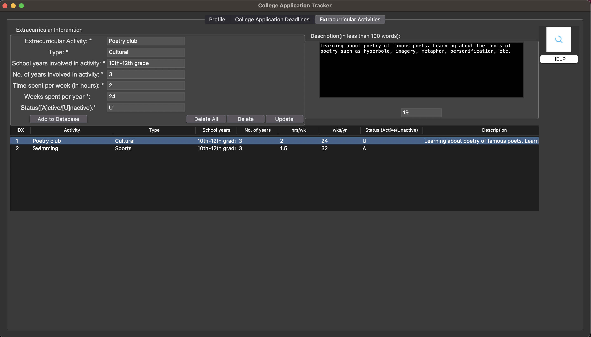

# Capstone Project

This is a basic college application tracker app made using python tkinter GUI. 

For database handling, sqlite3 is used. 

To run the application on your personal computer, do the following:

          python3 Capstone.py
# Demo of the College Application Tracker App

## Profile Page

## College Applications Page

Help button -->

## Extracurricular Activities Page

Help Button -->

